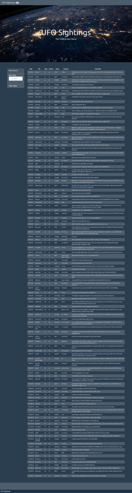

## This project is to create a basic HTML web page and write code that appends a table to it. Dataset used, is in the form of an array of JavaScript objects.

## Technology/Framework used:
* JavaScript
* D3.js

## screenshot of the web page - After appending table:

## screenshot of the web page - After applying filter:

